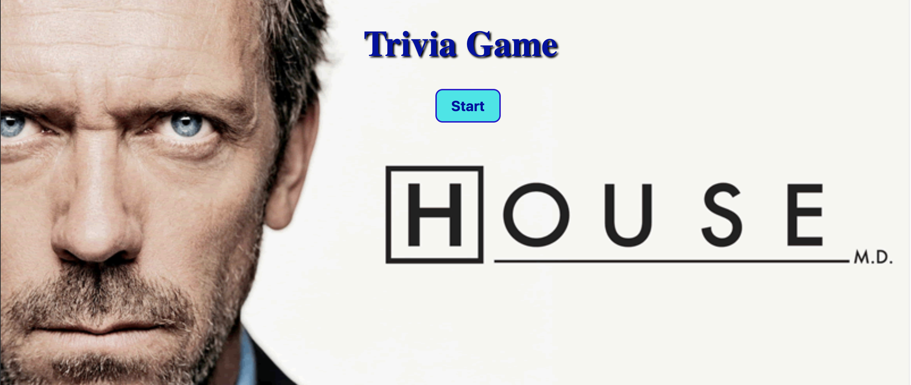
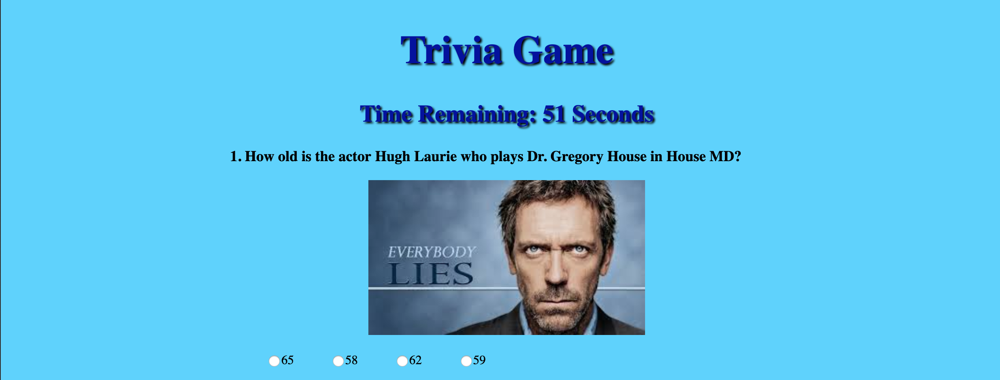

# House MD Trivia Game :hospital: :pill: :syringe:

### Welcome to my House MD trivia Game! You have 1 minute to answer 10 questions related to the hit TV show House starring Hugh Laurie as Dr. Gregory House. 

#### At the start of the game, you will see the following screen:

Click start to begin the quiz.

#### Once you click start, the game begins and you will see the following screen: 
 

The timer starts and you have 60 seconds to answer all 10 questions. Click on the Done button once you have answered all questions. If time runs out before you are able to answer all questions and click the done button, the quiz will time out and your quiz results will appear. 

#### Your results will be displayed as the following:

Results show how many questions you answered correct, incorrect and how many questions were left unanswered. 

## Deployed Site
Use this link to see the deployed site: https://jerpowel321.github.io/TriviaGame/

## Built With
- HTML
- CSS
- JavaScript
- JQuery

## Authors
Jennifer Powell 